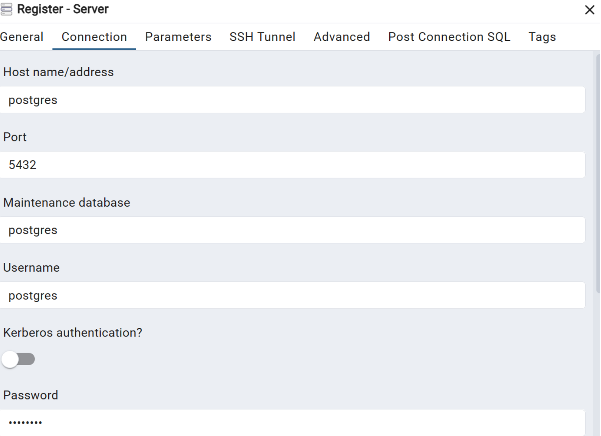

## Question 2:

### Step 1:
Make docker-compose.yaml in our directory 

### Step 2:
run docker compose

```bash 
docker-compose up
```

### Step 3:
acsess pgAdmin in browser by browsing to http://localhost:8080

### Step 4:
Login with email: pgadmin@pgadmin.com, password: pgadmin

### Step 5:
Configure:
- General tab: 
Name: pgdatabase

- Connection tab:
Host: postgres (the container name)
Port: 5432
Username: postgres
Password: postgres

### Output
